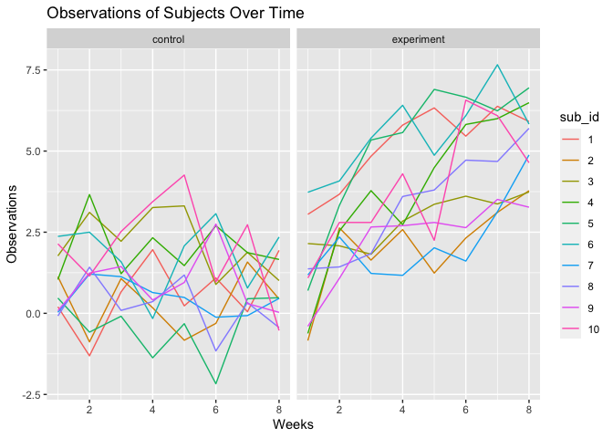

dxy2101_hw5_p8106
================
Daisy Yan
2022-11-10

``` r
library(tidyverse)
library(ggplot2)
```

## Problem 1

Create a tidy dataframe containing data from all participants, including
the subject ID, arm, and observations over time.

``` r
# Load data
study_files =
  tibble(files = list.files("./data")) %>%
  mutate(files = str_c("data", files, sep = "/"))

study_data =
  study_files %>%
  mutate(subjects = map(files, read_csv)) %>%
  mutate(arm = case_when(str_detect(files, "exp") ~ "experiment",
                         str_detect(files, "con") ~ "control"),
         sub_id = as.factor(parse_number(files))) %>%
  unnest(subjects) %>%
  pivot_longer(cols = week_1:week_8, names_to = "week", values_to = "observations") %>%
  mutate(week = as.numeric(parse_number(week)))
```

Make spaghetti plot.

``` r
study_data %>%
  ggplot(aes(x = week, y = observations, color = sub_id)) +
  geom_line() + ylab("Observations") + xlab("Weeks") +
  facet_grid(cols = vars(arm)) +
  ggtitle("Observations of Subjects Over Time")
```

<!-- -->

In the control group, subjects report similar observations over time. On
the other hand, in the experimental group, subjects reeport higher
observations over time.

## Problem 2

Describe raw dataset.

``` r
# Load data
url = 'https://raw.githubusercontent.com/washingtonpost/data-homicides/master/homicide-data.csv'

homicide_data =
  read_csv(url)
```

The homicide data set contains 52179 observations and 12 variables. The
variables included are the following: unique id, reported date, victim
characteristics (last name, first name, race, age, sex), location of
case (city, state, latitude, longitude), and disposition of case.

Create `city_state` variable. Summarize within cities to obtain number
of solved homicides and unsolved homicides.

``` r
# Create new variables and clean
homicide_data =
  homicide_data %>%
  mutate(city_state = str_c(city, state, sep = ", "),
         status = case_when(
           disposition == "Closed without arrest" ~ "unsolved",
           disposition == "Open/No arrest" ~ "unsolved",
           disposition == "Closed by arrest" ~ "solved"
         )) %>%
  select(-city, -state, -disposition) %>%
  relocate(city_state, .before = lat)

# Summarize
status_summary =
  homicide_data %>%
  group_by(city_state, status) %>%
  summarise(count = n())
```

Estimate proportion of unsolved homicides in Baltimore, MD.

``` r
# Filter to Baltimore
baltimore_data =
  homicide_data %>%
  filter(city_state == "Baltimore, MD") %>%
  summarise(
    unsolved = sum(status == "unsolved"),
    total = n()
  )

# prop.test
baltimore_prop =
  prop.test(
    x = baltimore_data$unsolved,
    n = baltimore_data$total
  )

baltimore_estimate =
  baltimore_prop %>%
  broom::tidy()
```

Estimate proportion of unsolved homicides all cities.

``` r
# Create function to run prop.test
prop_function = function(cities){
  
  cities_data  =
    cities %>%
    summarise(
      unsolved = sum(status == "unsolved"),
      total = n()
    )
  
  cities_prop =
    prop.test(
      x = cities_data %>% pull(unsolved),
      n = cities_data %>% pull(total)
    )
  
  cities_prop
}

# Test prop_function
prop_function(
  homicide_data%>%
  filter(city_state == "Baltimore, MD"))
```

    ## 
    ##  1-sample proportions test with continuity correction
    ## 
    ## data:  cities_data %>% pull(unsolved) out of cities_data %>% pull(total), null probability 0.5
    ## X-squared = 239.01, df = 1, p-value < 2.2e-16
    ## alternative hypothesis: true p is not equal to 0.5
    ## 95 percent confidence interval:
    ##  0.6275625 0.6631599
    ## sample estimates:
    ##         p 
    ## 0.6455607

``` r
# Iterate across all cities
results = 
  homicide_data %>% 
    nest(-city_state) %>% 
    mutate(
      test = map(data, prop_function),
      tidy = map(test, broom::tidy)
    ) %>% 
    select(city_state, tidy) %>% 
    unnest(tidy) %>% 
    select(city_state, estimate, starts_with('conf'))

results
```

    ## # A tibble: 51 × 4
    ##    city_state      estimate conf.low conf.high
    ##    <chr>              <dbl>    <dbl>     <dbl>
    ##  1 Albuquerque, NM    0.386    0.337     0.438
    ##  2 Atlanta, GA        0.383    0.353     0.415
    ##  3 Baltimore, MD      0.646    0.628     0.663
    ##  4 Baton Rouge, LA    0.462    0.414     0.511
    ##  5 Birmingham, AL     0.434    0.399     0.469
    ##  6 Boston, MA         0.505    0.465     0.545
    ##  7 Buffalo, NY        0.612    0.569     0.654
    ##  8 Charlotte, NC      0.300    0.266     0.336
    ##  9 Chicago, IL        0.736    0.724     0.747
    ## 10 Cincinnati, OH     0.445    0.408     0.483
    ## # … with 41 more rows
